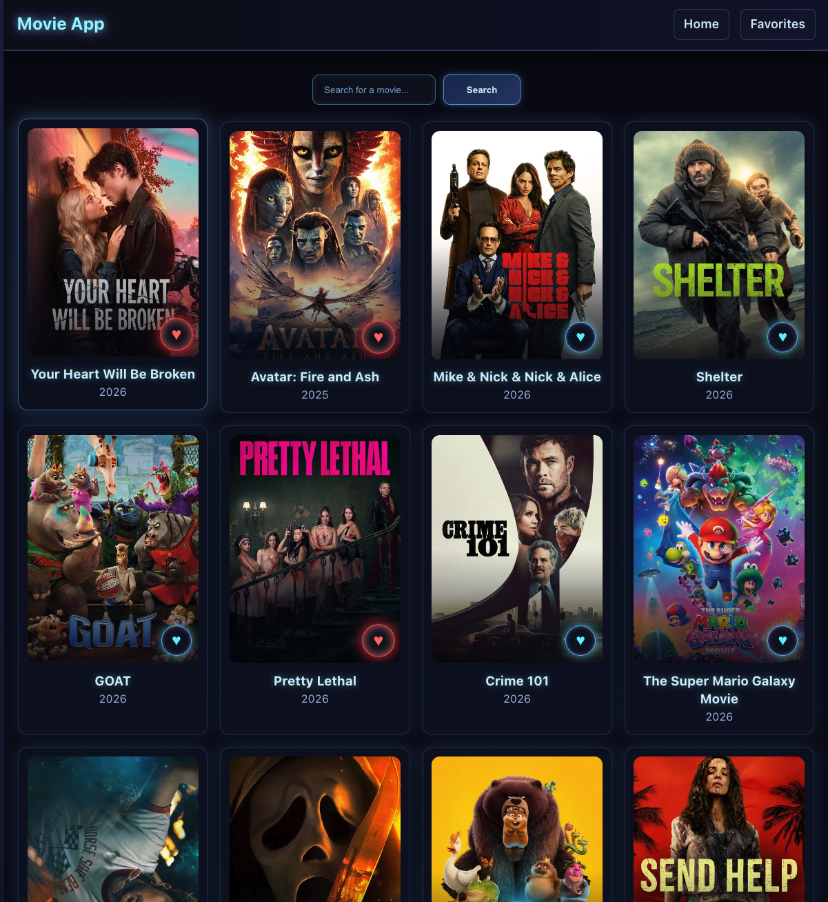
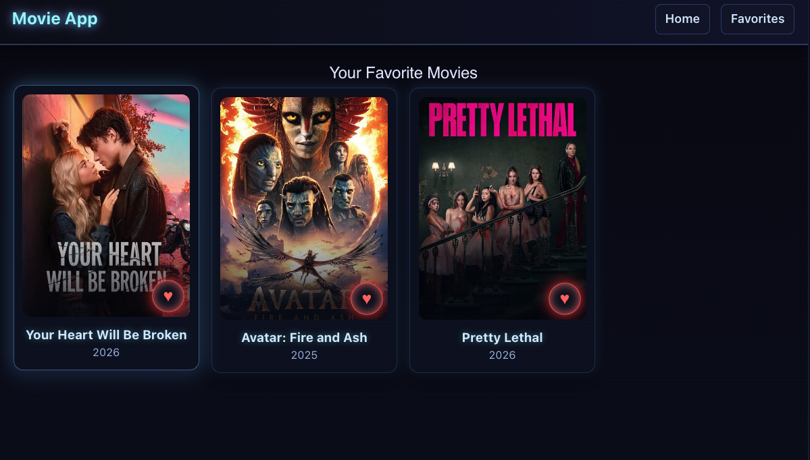

# Movie App

A React movie discovery application built to refresh React knowledge and skills.

## Overview

This project follows the tutorial: [Build a React Movie App](https://www.youtube.com/watch?v=G6D9cBaLViA)

A simple, responsive movie browser that lets users explore movies and save their favorites. The app fetches movie data from The Movie Database (TMDB) API and features smooth interactions and a polished dark theme UI.

## Technologies & Concepts

- **React 18** – Components, hooks, state management
- **Vite** – Fast build tool and dev server
- **Context API** – Global state management for favorites
- **TMDB API** – Real movie data
- **CSS3** – Custom styling, animations, and responsive design

## Features

- Browse popular movies
- Search for movies
- Add/remove movies from favorites with glowing active state
- Responsive grid layout
- Smooth UI animations and transitions

## Screenshots

### Home Page
Browse and search movies with the interactive favorite button:


### Favorites Page
View your saved favorite movies:


## Getting Started

```bash
npm install
npm run dev
```

